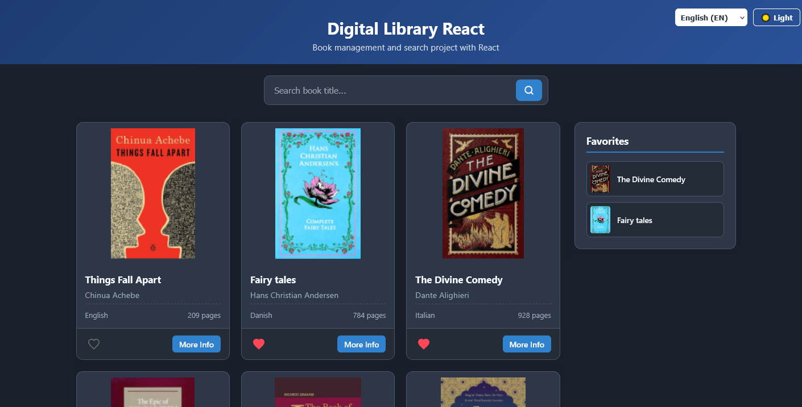

# 📚 Book Library App (V1)

* **Component-Driven Architecture:** Modular design using reusable components like `BookCard`, `SideCard`, `Search`, and `Layout`.
* **State Management:** Fully functional book search and a dynamic "Favorites" list to save books.
* **Context API Integration:** Implements `LanguageContext` for seamless switching between English and French, and `ThemeContext` for Dark/Light mode toggling.
* **Optimized Styling:** Styled using CSS Modules to ensure scoped and maintainable styles.
* **Mock Data:** Powered by a local `mockData.js` file for seamless catalog management.

---

## 📸 Preview

